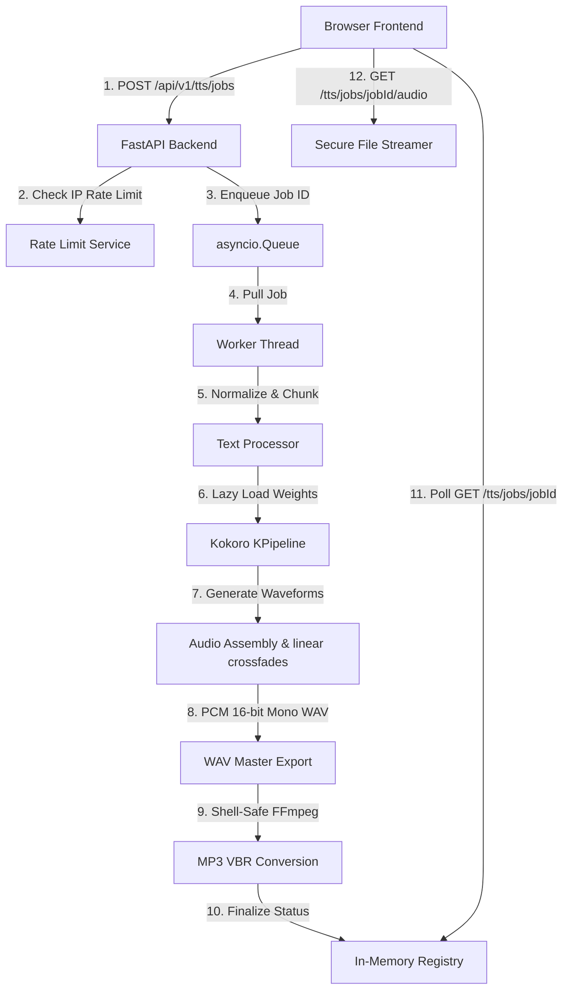

# Konthora - AI Audio Platform

**Konthora** is a production-ready web application hosting browser-based AI audio tools. The name is inspired by the Bengali word *"Kontho"*, meaning *voice*.

The application launches with:
1. **Text to Speech (TTS)**: Fully integrated with a local Python FastAPI backend using the high-quality open-weight **Kokoro-82M** model, compiling voiceovers into WAV/MP3 files.
2. **Audio Transcription**: Fully integrated with **faster-whisper** (small.en) for timestamped transcription. Supports MP3, WAV, M4A, AAC, MP4, WebM, and MOV files with sentence, paragraph, and word-level timestamps. Exports as TXT, SRT, VTT, and JSON.

## Deployment

| Document | Purpose |
| :--- | :--- |
| [DEPLOYMENT.md](DEPLOYMENT.md) | Full production setup: AWS EC2 / Ubuntu 24.04, Python, Node, Git, FFmpeg, eSpeak NG, venv, systemd, Nginx, Let's Encrypt, updates, rollback, troubleshooting. |
| [LAUNCH_CHECKLIST.md](LAUNCH_CHECKLIST.md) | Step-by-step go-live checklist (AWS, EC2, Elastic IP, Security Group, DNS, Vercel, SSL, Search Console, analytics, backups). |
| [deploy/AWS.md](deploy/AWS.md) | AWS recommendations: credit-budget tiers, benchmark-before-sizing, public IPv4 pricing, Security Groups, IAM, cost model (by region), scaling path. |
| [deploy/MONITORING.md](deploy/MONITORING.md) | Health endpoint, uptime, disk/RAM/CPU and log monitoring recommendations. |
| [deploy/SECURITY.md](deploy/SECURITY.md) | Security review: CORS, trusted hosts, headers, rate limiting, uploads, tokens, storage, log sanitization. |
| [deploy/PERFORMANCE.md](deploy/PERFORMANCE.md) | Performance review: queue, memory, startup, model loading, compression, caching. |
| [deploy/nginx/](deploy/nginx/) | Production Nginx configuration (TLS, security headers, uploads, timeouts). |
| [deploy/systemd/](deploy/systemd/) | `konthora.service` and `konthora-web.service` systemd units (backend + frontend). |
| [deploy/scripts/](deploy/scripts/) | Idempotent provisioning (`deploy.sh`, incl. TLS + model warm-up + frontend build), update, restart, stop, backup, cleanup, logs, healthcheck and rollback scripts. |
| [.env.example](.env.example) / [.env.production.example](.env.production.example) / [backend/.env.example](backend/.env.example) / [backend/.env.production.example](backend/.env.production.example) | Environment variable templates (`.env.production.example` → `/etc/konthora/web.env`). |

> **Architecture:** The **entire stack is self-hosted** on a single **AWS EC2**
> instance running **Ubuntu 24.04** behind **Nginx + Let's Encrypt**, supervised
> by **systemd**. `konthora.dev.bd` / `www.konthora.dev.bd` serve the Next.js
> frontend on `127.0.0.1:3000`; `api.konthora.dev.bd` serves the FastAPI backend
> on `127.0.0.1:8000`. Continuous integration runs in GitHub Actions (CI only —
> no automatic deployments).

> **Deploying:** `sudo bash deploy/scripts/deploy.sh` provisions a fresh Ubuntu
> host end-to-end (packages, repo, venv, **spaCy + Kokoro + Faster Whisper model
> warm-up**, secrets, **Next.js frontend build**, Nginx, Let's Encrypt TLS,
> both systemd units) and is safe to re-run. See [DEPLOYMENT.md](DEPLOYMENT.md).

---

## Technical Architecture & State Flow



---

## Technology Stack

* **Frontend**: Next.js App Router (TypeScript in strict mode, Tailwind CSS v4, Lucide React, ESLint).
* **Backend**: FastAPI (Python 3.11+, PyTorch, Kokoro, faster-whisper, eSpeak NG, FFmpeg, pytest).

---

## Installation & Setup

### 1. Prerequisites (Required Hosts)

* **FFmpeg**: Required on the system PATH to encode WAV files to MP3.
  * *Windows Setup*: Install via Winget `winget install Gyan.FFmpeg` or extract from Gyan.dev and add to system `PATH`.
* **eSpeak NG**: Required for English grapheme-to-phoneme (G2P) phonemizer translation.
  * *Windows Setup*: Run the installer and verify installation under `C:\Program Files\eSpeak NG`.

### 2. Backend Setup & Run

1. Navigate to the `backend/` folder and create a virtual environment:
   ```bash
   cd backend
   python -m venv .venv
   ```
2. Activate the virtual environment:
   * **Windows (PowerShell)**: `.venv\Scripts\Activate.ps1`
   * **Linux/macOS**: `source .venv/bin/activate`
3. Install dependencies:
   ```bash
   pip install -r requirements.txt
   pip install -r requirements-dev.txt
   ```
4. Create your local `backend/.env` file:
   ```env
   APP_ENV=development
   APP_PORT=8000
   ESPEAK_PATH=C:\Program Files\eSpeak NG
   TTS_JOB_RETENTION_MINUTES=60
   ```
5. Start the FastAPI server:
   ```bash
   # Make sure you are in the backend directory
   python -m uvicorn app.main:app --host 127.0.0.1 --port 8000 --reload
   ```

### 3. Frontend Setup & Run

1. Navigate back to the repository root:
   ```bash
   npm install
   ```
2. Configure `.env.local` (copy from the template):
   ```bash
   cp .env.example .env.local
   ```
   Then adjust values as needed (`NEXT_PUBLIC_API_URL=http://localhost:8000/api/v1`).
3. Start the Next.js development server:
   ```bash
   npm run dev
   ```
4. Access the workbench in your browser at `http://localhost:3000/text-to-speech`.

---

## System Limitations & Scopes

* **English Only**: The platform is restricted to English inputs (using `en-US` and `en-GB` accents). "Auto Detect" currently resolves to English.
* **Character Ceiling**: Strict limit of **2,000 characters** per guest synthesis session.
* **In-Memory Queue**: Submissions are scheduled in a bounded FIFO queue of size 10. Duplicate submissions above capacity receive an immediate `503 Service Unavailable (QUEUE_FULL)`.
* **Guest Rate Limiting**: Limit of **10 job creations per hour** per client IP.
* **Retention Policy**: Generated audio files and metadata expire and are deleted automatically after **60 minutes**.
* **State Loss on Restart**: All job states are in-memory. Restarting the backend wipes all jobs, although cached storage directories are cleaned on startup.
* **Temporary Local Storage**: Files are stored on local disk under `backend/storage` and expire automatically.
* **Single-Server MVP**: The backend uses an in-process asyncio queue and local storage. Multi-replica scaling requires transitioning to a shared message queue (e.g., Redis) and shared block storage.
* **Docker**: A Dockerfile is provided, but Docker is **not runtime-verified** in this repository.
* **No diarization, translation, or guaranteed perfect accuracy.**

## Verified Runtime

* **Python**: `3.11.9` (verified on Windows)
* **TTS**: Kokoro (`kokoro==0.7.16`) with `misaki` pinned to an immutable Git commit
* **Transcription**: faster-whisper (`faster-whisper==1.2.1`, `small.en`)
* **FFmpeg & FFprobe**: required on the system PATH
* **eSpeak NG**: required for Kokoro English phonemization
* **Domain**: https://konthora.dev.bd

---

## Verified Voice Catalogue

Every voice listed below is verified to compile, load, and synthesize waveforms correctly using the local eSpeak NG phonemizer and Kokoro engine:

| Accent | Voice ID | Gender | Description |
| :--- | :--- | :--- | :--- |
| **American English** | `af_heart` | Female | Soft, clear narration (Recommended ★) |
| **American English** | `af_bella` | Female | Bright, conversational tone |
| **American English** | `af_nicole` | Female | Warm, corporate presentation voice |
| **American English** | `af_nova` | Female | Clear, energetic voice |
| **American English** | `am_adam` | Male | Warm, narrative tone |
| **American English** | `am_michael` | Male | Professional, corporate narrator |
| **British English** | `bf_emma` | Female | Clear British accent, narrative (Recommended ★) |
| **British English** | `bf_isabella` | Female | Calm, articulate British tone |
| **British English** | `bm_george` | Male | Confident, narrative British accent |
| **British English** | `bm_lewis` | Male | Conversational, friendly British tone |

---

## Verification Commands

### Automated Tests
Run the mock unit tests suite (exits in < 1 second, does not fetch or download weights):
```bash
$env:PYTHONPATH="backend"
backend\.venv\Scripts\python -m pytest backend/app/tests -vv --timeout=30
```

Run the real-model synthesis integration test (separately):
```bash
$env:RUN_TTS_INTEGRATION_TESTS="1"
$env:PYTHONPATH="backend"
backend\.venv\Scripts\python -m pytest backend/app/tests/test_integration.py -vv -s --timeout=300
Remove-Item Env:RUN_TTS_INTEGRATION_TESTS -ErrorAction SilentlyContinue
```

Run the real-model transcription integration test (separately):
```bash
$env:RUN_TRANSCRIPTION_INTEGRATION_TESTS="1"
$env:PYTHONPATH="backend"
backend\.venv\Scripts\python -m pytest backend/app/tests/test_transcription_integration.py -vv -s --timeout=600
Remove-Item Env:RUN_TRANSCRIPTION_INTEGRATION_TESTS -ErrorAction SilentlyContinue
```

Verify the installed dependency tree is coherent (must print "No broken requirements found" and exit 0):
```bash
backend\.venv\Scripts\python -m pip check
```

### Frontend Optimization Checks
Verify TypeScript strict checks and production assets packaging:
```bash
# Strictly check typings
npx tsc --noEmit

# Run ESLint rules
npm run lint

# Compile Next.js production build
npm run build
```

---

## Docker Instructions

To run the backend in a containerized environment (which installs eSpeak NG and FFmpeg automatically in the Linux image):

1. Build the Docker image:
   ```bash
   docker build -t konthora-backend ./backend
   ```
2. Run the container:
   ```bash
   docker run -p 8000:8000 \
     -v $(pwd)/backend/storage:/app/storage \
     -v $(pwd)/backend/model_cache:/root/.cache/huggingface \
     konthora-backend
   ```
